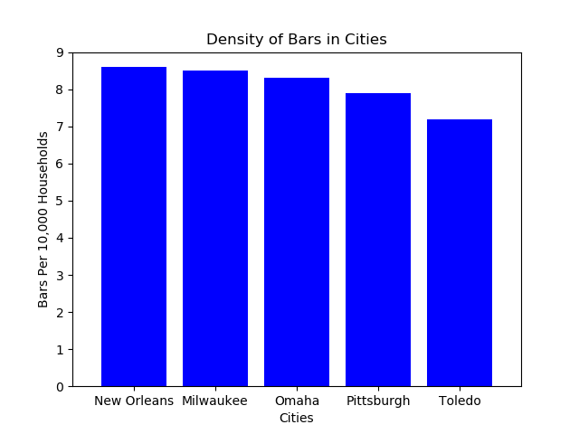

# Bars Bar Chart

In this activity, you will create a bar chart that visualizes the density of bars within major U.S. cities.

## Instructions

Using the [starter file](Unsolved/py_bars.ipynb), create a bar chart that matches the image provided below:

---

© 2021 Trilogy Education Services, LLC, a 2U, Inc. brand. Confidential and Proprietary. All Rights Reserved.
