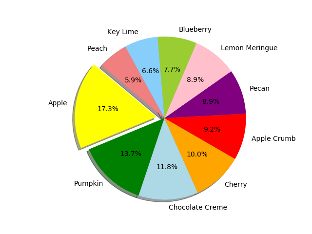

# Pies Pie Chart

In this activity, you will create a pie chart that visualizes favorite pies in the United States.

## Instructions

* Using the [starter file](Unsolved/py_pie.ipynb), create a pie chart that matches the image provided below:

---

© 2021 Trilogy Education Services, LLC, a 2U, Inc. brand. Confidential and Proprietary. All Rights Reserved.
