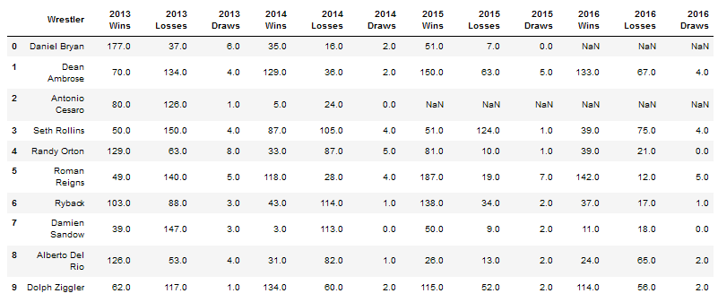

# Winner Wrestling, Part 1

This is part one of a series of three parts mini-project.

In this first part of the activity, you will be taking four separate csv files that were scraped down from a wrestling database, merging them together, and then creating charts to visualize a wrestler's wins and losses over the course of four years.

## Instructions 

* See comments in each cell in [Jupyter Notebook file](Unsolved/winning_wrestlers.ipynb) for activity instructions.

    * Your final table should look similar to the table below:

        

Data is a filtered dataset from [cagematch.net](https://www.cagematch.net/?id=8&nr=1&page=17&year=2013&s=0)

- - -

© 2021 Trilogy Education Services, LLC, a 2U, Inc. brand. Confidential and Proprietary. All Rights Reserved.
