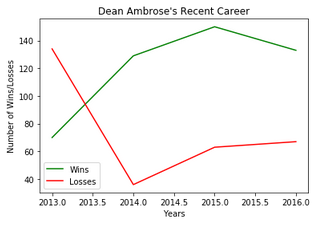

# Winner Wrestling, Part 3

This is the third and last part of a series of three parts mini-project.

In this final part, you will take the DataFrame they created and, using Matplotlib, chart the number of wins and losses an individual wrestler has had over the course of a career.

## Instructions 

* See comments in each cell in [Jupyter Notebook file](Unsolved/winning_wrestlers.ipynb) for activity instructions.

    * Your output should look similar to the figure shown below, depending on the user’s input variable: 

        

- - -

© 2021 Trilogy Education Services, LLC, a 2U, Inc. brand. Confidential and Proprietary. All Rights Reserved.
