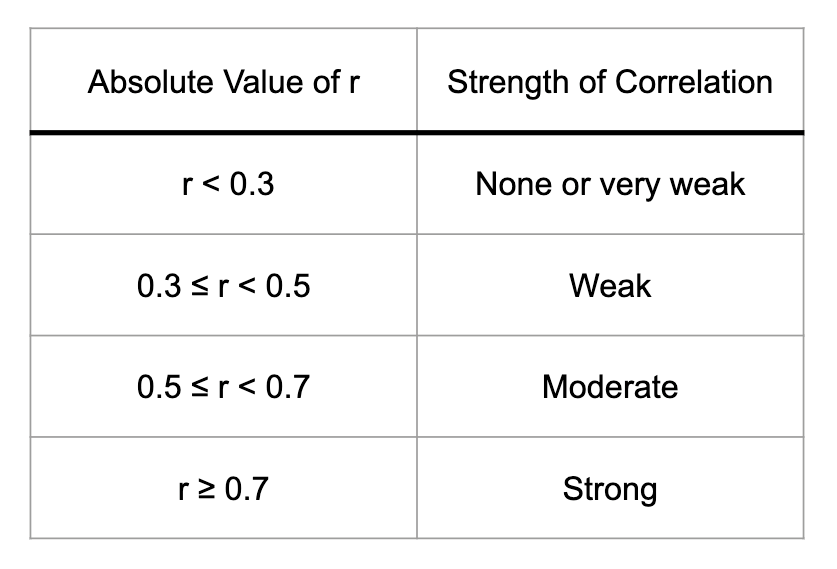

# Correlation Conquerors

This activity gives students an opportunity to use SciPy to compare factors across the scikit-learn's wine recognition dataset.

The wine recognition dataset is "the results of a chemical analysis of wines grown in the same region in Italy by three different cultivators." Measurements of * different constituents are taken for three types of wine.

## Instructions

* Open [correlations.ipynb](Unsolved/correlations.ipynb) in the activity folder.

* Execute the starter code to import the wine recognition dataset from scikit-learn.

* Using the dataset, plot the factors malic acid versus flavanoids on a scatter plot. Is this relationship positively correlated, negatively correlated, or not correlated? How strong is the correlation?

* Calculate the Pearson's correlation coefficient for  malic acid versus flavanoids. Compare the correlation coefficient to the Strength of Correlation table below. Was your prediction correct?

    

* Plot the factors alcohol versus color intensity on a scatter plot. Is this relationship positively correlated, negatively correlated, or not correlated? How strong is the correlation?

* Calculate the Pearson's correlation coefficient for alcohol versus color intensity. Compare the correlation coefficient to the Strength of Correlation table. Was your prediction correct?

## Bonus

* Look at the [Pandas documentation](https://pandas.pydata.org/pandas-docs/stable/) to find how to generate a correlation matrix. This matrix will contain the Pearson's correlation coefficient for all pairs of factors in the DataFrame.

* Generate the correlation matrix and try to find the pair of factors that generate the strongest positive and strongest negative correlations.

- - -

© 2021 Trilogy Education Services, LLC, a 2U, Inc. brand. Confidential and Proprietary. All Rights Reserved.
